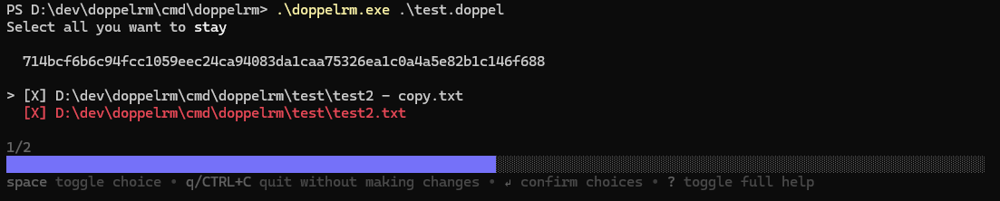

# doppelrm

A companion utility to [doppel](https://github.com/blackhawk42/doppel). It takes
doppel's output and starts a TUI interface to make deleting repeated files easier.

TUI made using the [Bubble Tea](https://github.com/charmbracelet/bubbletea) framework.

# Build

To build the main executable:

```shell
go build cmd/doppelrm
```

# Usage

For invocation help, run:

```shell
./doppelrm -h
```

For general usage, run:

```shell
./doppelrm DOPPEL_FILE
```

`DOPPEL_FILE` is a file of output generated by doppel. It may also be `-` for stdin, for use in pipes.


A TUI will start. Use up and down keys to move between files, and left and right
to move between hashes. Space toggles selection of a file. If a file is shown in
red, it means doppelrm thinks it doesn't exist.



Keep selected the files you want to **stay**.

Once you're done, press Enter to confirm choices and start deletion of anything that
was **not** selected. CTRL+C or `q` exits without doing anything.

Complete keybindings in a footer at the bottom, which can be expanded with `?`.